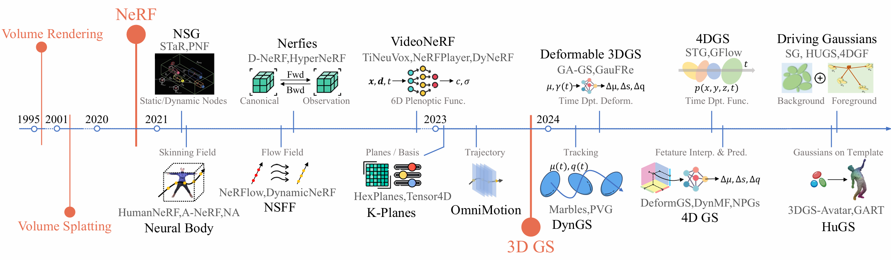
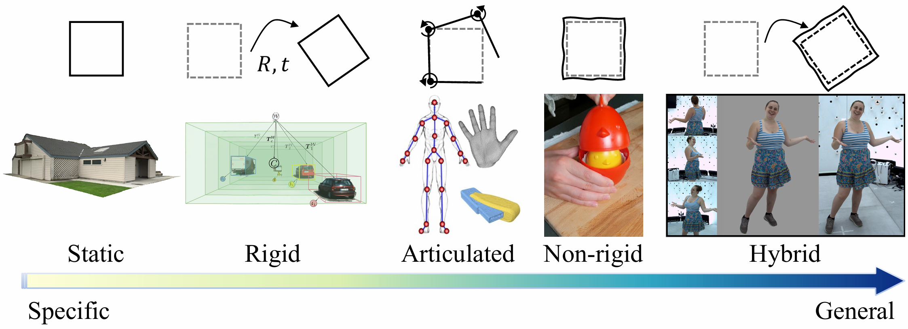
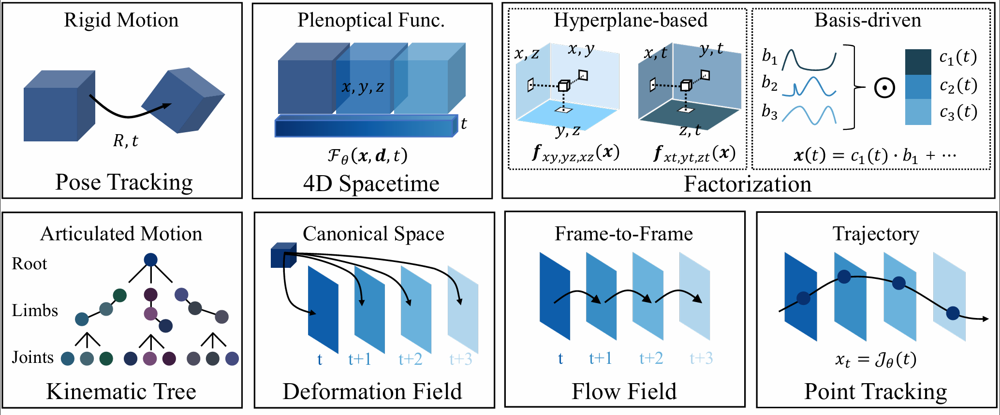
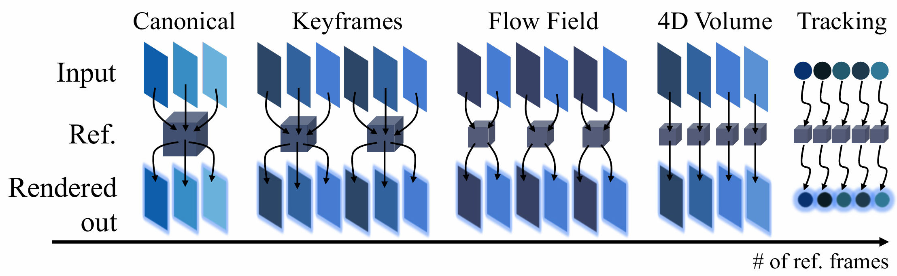

# Awesome-DynRF
<div style="text-align: center;">

[](https://arxiv.org/abs/2505.10049)

</div>



<div style="text-align: center;">

**Diverse methodological approaches under a unified representational framework**

</div>

More content and details can be found in our Survey Paper: [Advances in Radiance Field for Dynamic Scene: From Neural Field to Gaussian Field](https://arxiv.org/abs/2505.10049).

# 🔍 Contents
1. [Abstract](#-1-abstract)
2. [Taxonomy](#-2-taxonomy)
3. [Benchmark](#-3-benchmark)
4. [Paper Lists](#-4-paper-lists)
    * [4.1 Survey](#-41-survey)
    * [4.2 Reconstruction with Rigid Motion](#-42-reconstruction-with-rigid-motion)
    * [4.3 Reconstruction with Articulated Motion](#-43-reconstruction-with-articulated-motion)
    * [4.4 Reconstruction with Nor-rigid Motion](#-44-reconstruction-with-nor-rigid-motion)
5. [Citation](#-5-citation)
6. [Contact](#-6-contact)

# 📌 1. Abstract
Dynamic scene representation and reconstruction have undergone transformative advances in recent years, catalyzed by 
breakthroughs in neural radiance fields and 3D Gaussian splatting techniques. While initially developed for static 
environments, these methodologies have rapidly evolved to address the complexities inherent in 4D dynamic scenes 
through an expansive body of research. Coupled with innovations in differentiable volumetric rendering, these approaches
have significantly enhanced the quality of motion representation and dynamic scene reconstruction, thereby garnering 
substantial attention from the computer vision and graphics communities. This survey presents a systematic analysis 
of over 200 papers focused on dynamic scene representation using radiance field, spanning the spectrum from implicit 
neural representations to explicit Gaussian primitives. We categorize and evaluate these works through multiple critical
lenses: motion representation paradigms, reconstruction techniques for varied scene dynamics, auxiliary information 
integration strategies, and regularization approaches that ensure temporal consistency and physical plausibility. 
We organize diverse methodological approaches under a unified representational framework, concluding with a critical 
examination of persistent challenges and promising research directions. By providing this comprehensive overview, 
we aim to establish a definitive reference for researchers entering this rapidly evolving field while offering 
experienced practitioners a systematic understanding of both conceptual principles and practical frontiers in dynamic 
scene reconstruction.

# 📚 2. Taxonomy
## 2.1 Motion Types


<div style="text-align: center;">

**A 2D illustration of various motion types**

</div>

Real-world environments exhibit diverse motion patterns that can be categorized hierarchically from specific to general 
types. We classify these patterns into rigid motion, articulated motion, general non-rigid motion, and hybrid motion, 
which combines multiple patterns.

## 2.2 Motion Representation Methods


<div style="text-align: center;">

**Illustration of typical motion representation methods**

</div>

## 2.3 Scene Representation


<div style="text-align: center;">

**A unified framework to encapsulate various reconstruction paradigms**

</div>

# ⚡ 3. Benchmark
| Datasets              | Year | Inputs                                                             | Additional Annotations                                                            | Motion                  |
|-----------------------|------|--------------------------------------------------------------------|-----------------------------------------------------------------------------------|-------------------------|
| 🟥 Tanks and Temples  | 2017 | Monocular videos                                                   | 3D surface geometry                                                               | Non-rigid Motion        |
| 🟥 CMU Panoptic       | 2017 | Multi-view videos, 480 VGA camera views, 10 RGB-D sensors          | 3D body pose, 3D facial landmarks, Transcripts + speaker ID                       | Non-rigid Motion        |
| 🟥 D-NeRF             | 2021 | Monocular videos                                                   | -                                                                                 | Non-rigid Motion        |
| 🟥 Plenoptic          | 2022 | Multi-view videos                                                  | Depth maps, RGB images, and calibration data                                      | Non-rigid Motion        |
| 🟥 Tensor4d           | 2023 | Multi-view videos captured by RGB cameras                          | -                                                                                 | Non-rigid Motion        |
| 🟥 Epic Fields        | 2024 | Monocular videos                                                   | Semantic annotations for actions and objects, masks of hands and active objects   | Non-rigid Motion        |
| 🟨 KITTI              | 2012 | Stereo images                                                      | Stereo images, optical flow, visual odometry, 3D object detection, 3D tracking    | Rigid Motion            |
| 🟨 nuScenes           | 2020 | 1 LiDAR, 5 RADAR, 6 cameras, IMU, and GPS                          | 3D bounding boxes, semantic categories, object attributes for 23 object classes   | Rigid Motion            |
| 🟨 Waymo              | 2020 | High-resolution sensor data (LiDAR, camera, radar)                 | 3D semantic segmentation labels, object trajectories, 3D maps                     | Rigid Motion            |
| 🟨 KITTI-360          | 2022 | Fisheye images, Pushbroom laser scans, Geo-localized vehicle poses | Semantic instance annotations in 2D and 3D Accurate localization                  | Rigid Motion            |
| 🟨 Virtual KITTI 2    | 2020 | RGB images                                                         | Semantic segmentation, instance segmentation, depth, optical flow, and scene flow | Rigid Motion            |
| 🟨 NeRF On-The-Road   | 2023 | Subset of Waymo open Dataset (dynamic driving scenes)              | Scene geometry, appearance, motion, and semantics via self-supervision            | Rigid Motion            |
| 🟨 Argoverse NVS      | 2024 | High-res images from 7 ring cameras, 2 stereo cameras, LiDAR       | 3D cuboid annotations for 26 object categories, map-aligned poses, and HD maps    | Rigid Motion            |
| 🟦 RobustNeRF Dataset | 2023 | Multi-view videos with dynamic distractors                         | Distractors modeled as outliers                                                   | Dynamic Noise           |
| 🟩 People-Snapshot    | 2018 | Monocular videos                                                   | 3D body models, textures, and animation skeletons                                 | Articulated & Non-rigid |
| 🟩 DynaCap            | 2021 | Multi-view videos                                                  | -                                                                                 | Articulated & Non-rigid |
| 🟩 ZJU-Mocap          | 2021 | Multi-view videos                                                  | -                                                                                 | Articulated & Non-rigid |
| 🟩 Neuman             | 2022 | Monocular videos                                                   | Human pose, shape, masks, camera poses, sparse scene model, and depth maps        | Articulated & Non-rigid |
| 🟩 THuman4            | 2022 | Multi-view videos                                                  | Foreground segmentation, calibration data, and SMPL-X fitting                     | Articulated & Non-rigid |
| 🟩 ActorsHQ           | 2023 | Multi-view videos from 160 synchronized cameras                    | Axis-aligned bounding boxes, occupancy grids, Alembic format meshes               | Articulated & Non-rigid |
| 🟩 CoP3D              | 2023 | Monocular casual videos of different cats and dogs                 | Camera parameters and object masks                                                | Articulated & Non-rigid |

# 📜 4. Paper Lists
## 📚 4.1 Survey
### 📝 4.1.1 perprint
| **Year** | **Conference/Journal** | **Paper**                                                                                                                                         | **Code** | **Type** |
|----------|------------------------|---------------------------------------------------------------------------------------------------------------------------------------------------|----------|----------|
| 2020     | arXiv                  | [Differentiable rendering: A survey](https://arxiv.org/abs/2006.12057)                                                                            |          | Survey   |
| 2020     | arXiv                  | [Neural volume rendering: Nerf and beyond](https://arxiv.org/abs/2101.05204)                                                                      |          | Survey   |
| 2020     | arXiv                  | [Nerf: Neural radiance field in 3d vision, a comprehensive review](https://arxiv.org/abs/2210.00379)                                              |          | Survey   |
| 2020     | arXiv                  | [BeyondPixels: A comprehensive review of the evolution of neural radiance fields](https://ui.adsabs.harvard.edu/abs/2023arXiv230603000S/abstract) |          | Survey   |
| 2020     | arXiv                  | [Neural radiance fields: Past, present, and future](https://arxiv.org/abs/2304.10050)                                                             |          | Survey   |
| 2020     | arXiv                  | [A survey on 3d gaussian splatting](https://arxiv.org/abs/2401.03890)                                                                             |          | Survey   |
| 2020     | arXiv                  | [3d gaussian as a new vision era: A survey](https://ui.adsabs.harvard.edu/abs/2024arXiv240207181F/abstract)                                       |          | Survey   |
| 2020     | arXiv                  | [Semantically-aware neural radiance fields for visual scene understanding: A comprehensive review](https://arxiv.org/abs/2402.11141)              |          | Survey   |
| 2020     | arXiv                  | [Neural Radiance Field in Urban: A Survey](https://arxiv.org/abs/2404.13816)                                                                      |          | Survey   |
| 2020     | arXiv                  | [How nerfs and 3d gaussian splatting are reshaping slam: A survey](https://fabiotosi92.github.io/files/survey-slam.pdf)                           |          | Survey   |
| 2020     | arXiv                  | [NeRF in robotics: A survey](https://arxiv.org/abs/2405.01333)                                                                                    |          | Survey   |
| 2020     | arXiv                  | [Neural Fields in Robotics: A Survey](https://arxiv.org/abs/2410.20220)                                                                           |          | Survey   |

### 📄 4.1.2 Paper
| **Year** | **Conference/Journal**     | **Paper**                                                                                                                                                                                                                                                                                      | **Code** | **Type** |
|----------|----------------------------|------------------------------------------------------------------------------------------------------------------------------------------------------------------------------------------------------------------------------------------------------------------------------------------------|----------|----------|
| 2022     | Computer Graphics Forum    | [Neural fields in visual computing and beyond](https://onlinelibrary.wiley.com/doi/abs/10.1111/cgf.14505)                                                                                                                                                                                      |          | Survey   |
| 2024     | IEEE TVCG                  | [3d gaussian splatting as new era: A survey](https://ieeexplore.ieee.org/abstract/document/10521791/?casa_token=0QyGxTRXcuoAAAAA:lcs7VXV5u9xntc4wQtFBjAejlh5aAHHDboeQDN1aQu-SPdVgZRMB1341gfWlt7iKSB7N2Eg2moE)                                                                                  |          | Survey   |
| 2024     | Computational Visual Media | [Recent advances in 3d gaussian splatting](https://link.springer.com/article/10.1007/s41095-024-0436-y)                                                                                                                                                                                        |          | Survey   |
| 2025     | IEEE TCSVT                 | [3d gaussian splatting: Survey, technologies, challenges, and opportunities](https://ieeexplore.ieee.org/abstract/document/10870258/?casa_token=sf77HC5Y85sAAAAA:2ukklYMHulxMaKfBV-AH9I0ZpOrnj8tcGv3cAZGp_5d5H7dWAw7yjjIy4RT1Ln5vG5Q0gr7e168)                                                  |          | Survey   |
| 2024     | IEEE Access                | [Gaussian splatting: 3d reconstruction and novel view synthesis, a review](https://ieeexplore.ieee.org/abstract/document/10545567/)                                                                                                                                                            |          | Survey   |
| 2022     | ICSPS                      | [Human 3d avatar modeling with implicit neural representation: A brief survey](https://ieeexplore.ieee.org/abstract/document/10218567/?casa_token=eqD5GGUIgHcAAAAA:kqCuDuxbKgYy5Ndn6Qu2ORYScL62HXkLSNAhcLNyOXZCNwQykukvkhk1mhgoaCos4H_gTrZGG0aJGA)                                             |          | Survey   |
| 2025     | EAAI                       | [Benchmarking neural radiance fields for autonomous robots: An overview](https://www.sciencedirect.com/science/article/pii/S0952197624018438?casa_token=lUGEAcODULoAAAAA:RoeYzcwQpI4VUAsp6zAnrwWX7ipHVRyi3V1JsCl9JaKDAHQZdAiATK8sxLBzmtPLlVhyC57awT4)                                          |          | Survey   |
| 2024     | CGF                        | [Recent Trends in 3D Reconstruction of General Non-Rigid Scenes](https://onlinelibrary.wiley.com/doi/abs/10.1111/cgf.15062)                                                                                                                                                                    |          | Survey   |
| 2023     | CGF                        | [State of the Art in Dense Monocular Non-Rigid 3D Reconstruction](https://onlinelibrary.wiley.com/doi/abs/10.1111/cgf.14774)                                                                                                                                                                   |          | Survey   |
| 2024     | RCIM                       | [Neural radiance fields in the industrial and robotics domain: Applications, research opportunities and use cases](https://www.sciencedirect.com/science/article/pii/S0736584524000978?casa_token=IbEL6IFsBrcAAAAA:N1ijHI5IXgjmtYh0WVADDM4OBXoHsdAMhef9VZohHdghCTMo-8QBBfCvPgbASBFib8yr_ywZRg) |          | Survey   |
| 2024     | Electronics                | [A Brief Review on Differentiable Rendering: Recent Advances and Challenges](https://www.mdpi.com/2079-9292/13/17/3546)                                                                                                                                                                        |          | Survey   |

## 🏗️ 4.2 Reconstruction with Rigid Motion
### 📝 4.2.1 perprint
| **Year** | **Conference/Journal** | **Paper**                                                                                                                                   | **Code** | **Type** |
|----------|------------------------|---------------------------------------------------------------------------------------------------------------------------------------------|----------|----------|
| 2023     | Arxiv                  | [Prosgnerf: Progressive dynamic neural scene graph with frequency modulated auto-encoder in urban scenes](https://arxiv.org/abs/2312.09076) |          | Urban    |

### 📄 4.2.2 Paper
| **Year** | **Conference/Journal** | **Paper**                                                                                                                                                                                                                                                                      | **Code**                                                                       | **Type** |
|----------|------------------------|--------------------------------------------------------------------------------------------------------------------------------------------------------------------------------------------------------------------------------------------------------------------------------|--------------------------------------------------------------------------------|----------|
| 2024     | ECCV                   | [Street gaussians: Modeling dynamic urban scenes with gaussian splatting](https://arxiv.org/abs/2401.01339)                                                                                                                                                                    | [Code](https://github.com/zju3dv/street_gaussians)                             | Urban    |
| 2021     | CVPR                   | [Neural scene graphs for dynamic scenes ](http://openaccess.thecvf.com/content/CVPR2021/html/Ost_Neural_Scene_Graphs_for_Dynamic_Scenes_CVPR_2021_paper.html)                                                                                                                  | [Code](https://github.com/princeton-computational-imaging/neural-scene-graphs) | Urban    |
| 2024     | CVPR                   | [Multi-level neural scene graphs for dynamic urban environments](http://openaccess.thecvf.com/content/CVPR2024/html/Fischer_Multi-Level_Neural_Scene_Graphs_for_Dynamic_Urban_Environments_CVPR_2024_paper.html)                                                               | [Code](https://github.com/tobiasfshr/map4d)                                    | Urban    |
| 2024     | CVPR                   | [3d geometry-aware deformable gaussian splatting for dynamic view synthesis](http://openaccess.thecvf.com/content/CVPR2024/html/Lu_3D_Geometry-Aware_Deformable_Gaussian_Splatting_for_Dynamic_View_Synthesis_CVPR_2024_paper.html)                                            | [Code](https://github.com/zhichengLuxx/GaGS)                                   | Urban    |
| 2021     | CVPR                   | [Star: Selfsupervised tracking and reconstruction of rigid objects in motion with neural rendering](http://openaccess.thecvf.com/content/CVPR2021/html/Yuan_STaR_Self-Supervised_Tracking_and_Reconstruction_of_Rigid_Objects_in_Motion_CVPR_2021_paper.html)                  |                                                                                | Indoor   |
| 2022     | CVPR                   | [Panoptic neural fields: A semantic object-aware neural scene representation](http://openaccess.thecvf.com/content/CVPR2022/html/Kundu_Panoptic_Neural_Fields_A_Semantic_Object-Aware_Neural_Scene_Representation_CVPR_2022_paper.html)                                        |                                                                                | Urban    |
| 2024     | CVPR                   | [Hugs: Holistic urban 3d scene understanding via gaussian splatting](http://openaccess.thecvf.com/content/CVPR2024/html/Zhou_HUGS_Holistic_Urban_3D_Scene_Understanding_via_Gaussian_Splatting_CVPR_2024_paper.html)                                                           | [Code](https://github.com/hyzhou404/HUGS)                                      | Urban    |
| 2023     | ICLR                   | [S-nerf: Neural radiance fields for street views](https://openreview.net/forum?id=gx2yJS-ENqI)                                                                                                                                                                                 | [Code](https://github.com/fudan-zvg/S-NeRF)                                    | Urban    |
| 2024     | CVPR                   | [Drivinggaussian: Composite gaussian splatting for surrounding dynamic autonomous driving scenes](http://openaccess.thecvf.com/content/CVPR2024/html/Zhou_DrivingGaussian_Composite_Gaussian_Splatting_for_Surrounding_Dynamic_Autonomous_Driving_Scenes_CVPR_2024_paper.html) | [Code](https://github.com/VDIGPKU/DrivingGaussian)                             | Urban    |
| 2023     | CVPR                   | [Unisim: A neural closedloop sensor simulator](http://openaccess.thecvf.com/content/CVPR2023/html/Yang_UniSim_A_Neural_Closed-Loop_Sensor_Simulator_CVPR_2023_paper.html)                                                                                                      | [Project Site](https://waabi.ai/unisim/)                                       | Urban    |
| 2024     | CVPR                   | [Neurad: Neural rendering for autonomous driving](http://openaccess.thecvf.com/content/CVPR2024/html/Tonderski_NeuRAD_Neural_Rendering_for_Autonomous_Driving_CVPR_2024_paper.html)                                                                                            | [Code](https://github.com/georghess/neurad-studio)                             | Urban    |

## 🕺 4.3 Reconstruction with Articulated Motion
### 📝 4.3.1 Human Body-Perprint 
| **Year** | **Conference/Journal** | **Paper**                                                                                                                          | **Code**                                                      | **Type**   |
|----------|------------------------|------------------------------------------------------------------------------------------------------------------------------------|---------------------------------------------------------------|------------|
| 2022     | Arxiv                  | [Generalizable neural performer: Learning robust radiance fields for human novel view synthesis](https://arxiv.org/abs/2204.11798) | [Code](https://github.com/generalizable-neural-performer/gnr) | Human Body |
| 2023     | Arxiv                  | [Splatarmor: Articulated gaussian splatting for animatable humans from monocular rgb video](https://arxiv.org/abs/2311.10812)      |                                                               | Human Body |
| 2024     | Arxiv                  | [Bags: Building animatable gaussian splatting from a monocular video with diffusion priors](https://arxiv.org/abs/2403.11427)      | [Code](https://github.com/Michaelszj/bags)                    | Human Body |

### 📄 4.3.2 Human Body-Paper
| **Year** | **Conference/Journal** | **Paper**                                                                                                                                                                                                                                                                               | **Code**                                                        | **Type**            |
|----------|------------------------|-----------------------------------------------------------------------------------------------------------------------------------------------------------------------------------------------------------------------------------------------------------------------------------------|-----------------------------------------------------------------|---------------------|
| 2022     | CVPR                   | [Humannerf: Freeviewpoint rendering of moving people from monocular video](http://openaccess.thecvf.com/content/CVPR2022/html/Weng_HumanNeRF_Free-Viewpoint_Rendering_of_Moving_People_From_Monocular_Video_CVPR_2022_paper.html)                                                       | [Code](https://github.com/chungyiweng/humannerf)                | Human Body          |
| 2021     | CVPR                   | [Animatable neural radiance fields for modeling dynamic human bodies](https://openaccess.thecvf.com/content/ICCV2021/html/Peng_Animatable_Neural_Radiance_Fields_for_Modeling_Dynamic_Human_Bodies_ICCV_2021_paper.html?ref=https://githubhelp.com)                                     | [Code](https://github.com/zju3dv/animatable_nerf)               | Human Body          |
| 2023     | NeurIPS                | [Neural human performer: Learning generalizable radiance fields for human performance rendering](https://proceedings.neurips.cc/paper/2021/hash/cf866614b6b18cda13fe699a3a65661b-Abstract.html)                                                                                         | [Code](https://github.com/YoungJoongUNC/Neural_Human_Performer) | Human Body          |
| 2023     | CVPR                   | [Vid2avatar: 3d avatar reconstruction from videos in the wild via self-supervised scene decomposition](http://openaccess.thecvf.com/content/CVPR2023/html/Guo_Vid2Avatar_3D_Avatar_Reconstruction_From_Videos_in_the_Wild_via_CVPR_2023_paper.html)                                     |                                                                 | Human Body          |
| 2023     | ICCV                   | [Npc: Neural point characters from video](http://openaccess.thecvf.com/content/ICCV2023/html/Su_NPC_Neural_Point_Characters_from_Video_ICCV_2023_paper.html)                                                                                                                            | [Code](https://github.com/LemonATsu/NPC-pytorch)                | Human Body          |
| 2022     | ECCV                   | [Tava: Template-free animatable volumetric actors](https://arxiv.org/abs/2206.08929)                                                                                                                                                                                                    | [Code](https://github.com/facebookresearch/tava)                | Human Body          |
| 2021     | TOG                    | [Neural actor: Neural free-view synthesis of human actors with pose control](https://dl.acm.org/doi/abs/10.1145/3478513.3480528)                                                                                                                                                        |                                                                 | Human Body          |
| 2021     | ICCV                   | [Neural articulated radiance field](http://openaccess.thecvf.com/content/ICCV2021/html/Noguchi_Neural_Articulated_Radiance_Field_ICCV_2021_paper.html)                                                                                                                                  | [Code](https://github.com/nogu-atsu/NARF)                       | Human Body          |
| 2021     | NeurIPS                | [Neural human performer: Learning generalizable radiance fields for human performance rendering](https://proceedings.neurips.cc/paper/2021/hash/cf866614b6b18cda13fe699a3a65661b-Abstract.html)                                                                                         | [Code](https://github.com/YoungJoongUNC/Neural_Human_Performer) | Human Body          |
| 2023     | CVPR                   | [Monohuman: Animatable human neural field from monocular video](http://openaccess.thecvf.com/content/CVPR2023/html/Yu_MonoHuman_Animatable_Human_Neural_Field_From_Monocular_Video_CVPR_2023_paper.html)                                                                                | [Code](https://github.com/Yzmblog/MonoHuman)                    | Human Body          |
| 2022     | CVPR                   | [Structured local radiance fields for human avatar modeling ](http://openaccess.thecvf.com/content/CVPR2022/html/Zheng_Structured_Local_Radiance_Fields_for_Human_Avatar_Modeling_CVPR_2022_paper.html)                                                                                 |                                                                 | Human Body          |
| 2023     | CVPR                   | [Instant-NVR: Instant neural volumetric rendering for human-object interactions from monocular RGBD stream](http://openaccess.thecvf.com/content/CVPR2023/html/Jiang_Instant-NVR_Instant_Neural_Volumetric_Rendering_for_Human-Object_Interactions_From_Monocular_CVPR_2023_paper.html) |                                                                 | Human Body          |
| 2023     | CVPR                   | [Instantavatar: Learning avatars from monocular video in 60 seconds](http://openaccess.thecvf.com/content/CVPR2023/html/Jiang_InstantAvatar_Learning_Avatars_From_Monocular_Video_in_60_Seconds_CVPR_2023_paper.html)                                                                   | [Code](https://github.com/tijiang13/InstantAvatar)              | Human Body          |
| 2021     | ICCV                   | [Snarf: Differentiable forward skinning for animating non-rigid neural implicit shapes](http://openaccess.thecvf.com/content/ICCV2021/html/Chen_SNARF_Differentiable_Forward_Skinning_for_Animating_Non-Rigid_Neural_Implicit_Shapes_ICCV_2021_paper.html)                              |                                                                 | Human Body          |
| 2023     | TPAMI                  | [Fast-snarf: A fast deformer for articulated neural fields](https://ieeexplore.ieee.org/abstract/document/10112633/)                                                                                                                                                                    | [Code](https://github.com/xuchen-ethz/fast-snarf)               | Human Body          |
| 2022     | CVPR                   | [Pina: Learning a personalized implicit neural avatar from a single rgb-d video sequence](http://openaccess.thecvf.com/content/CVPR2022/html/Dong_PINA_Learning_a_Personalized_Implicit_Neural_Avatar_From_a_Single_CVPR_2022_paper.html)                                               |                                                                 | Human Body          |
| 2023     | CVPR                   | [X-avatar: Expressive human avatars](https://openaccess.thecvf.com/content/CVPR2023/html/Shen_X-Avatar_Expressive_Human_Avatars_CVPR_2023_paper.html)                                                                                                                                   | [Code](https://github.com/Skype-line/X-Avatar)                  | Human Body          |
| 2021     | CVPR                   | [Pixel-aligned volumetric avatars](http://openaccess.thecvf.com/content/CVPR2021/html/Raj_Pixel-Aligned_Volumetric_Avatars_CVPR_2021_paper.html)                                                                                                                                        |                                                                 | Human Head          |
| 2024     | CVPR                   | [4k4d: Real-time 4d view synthesis at 4k resolution](https://openaccess.thecvf.com/content/CVPR2024/papers/Xu_4K4D_Real-Time_4D_View_Synthesis_at_4K_Resolution_CVPR_2024_paper.pdf)                                                                                                    |                                                                 | Human Performance   |
| 2021     | ACM TOG                | [Real-time deep dynamic characters](https://arxiv.org/pdf/2105.01794)                                                                                                                                                                                                                   |                                                                 | Human Performance   |
| 2021     | NeurIPS                | [A-nerf: Articulated neural radiance fields for learning human shape, appearance, and pose](https://proceedings.neurips.cc/paper/2021/hash/65fc9fb4897a89789352e211ca2d398f-Abstract.html)                                                                                              | [Code](https://github.com/LemonATsu/A-NeRF)                     | Human Body          |
| 2021     | ICCV                   | [Neural articulated radiance field](http://openaccess.thecvf.com/content/ICCV2021/html/Noguchi_Neural_Articulated_Radiance_Field_ICCV_2021_paper.html)                                                                                                                                  | [Code](https://github.com/nogu-atsu/NARF)                       | Human Body          |
|          |                        | [Nasa neural articulated shape approximation](https://scribblethink.org/Work/Pdfs/deng_NasaNeuralArticulatedShapeApproximation.pdf)                                                                                                                                                     |                                                                 |                     |
| 2021     | CVPR                   | [Lasr: Learning articulated shape reconstruction from a monocular video](http://openaccess.thecvf.com/content/CVPR2021/html/Yang_LASR_Learning_Articulated_Shape_Reconstruction_From_a_Monocular_Video_CVPR_2021_paper.html)                                                            | [Code](https://github.com/google/lasr)                          | Human Body          |
| 2021     | NeurIPS                | [Viser: Video-specific surface embeddings for articulated 3d shape reconstruction](https://proceedings.neurips.cc/paper/2021/hash/a11f9e533f28593768ebf87075ab34f2-Abstract.html)                                                                                                       | [Code](https://github.com/gengshan-y/viser)                     | Human Body          |
|          |                        | **👆 NeRF-based**                                                                                                                                                                                                                                                                       | **👇 3DGS-based**                                               |                     |
| 2024     | CVPR                   | [Hugs: Human gaussian splats](http://openaccess.thecvf.com/content/CVPR2024/html/Kocabas_HUGS_Human_Gaussian_Splats_CVPR_2024_paper.html)                                                                                                                                               | [Code](https://github.com/apple/ml-hugs)                        | Human Body          |
| 2024     | CVPR                   | [Gart: Gaussian articulated template models](https://openaccess.thecvf.com/content/CVPR2024/html/Lei_GART_Gaussian_Articulated_Template_Models_CVPR_2024_paper.html)                                                                                                                    | [Code](https://github.com/JiahuiLei/GART)                       | Human Body          |
| 2024     | CVPR                   | [Expressive wholebody 3D gaussian avatar](https://fq.pkwyx.com/default/https/www.ecva.net/papers/eccv_2024/papers_ECCV/papers/05715.pdf)                                                                                                                                                | [Code](https://github.com/mks0601/ExAvatar_RELEASE)             | Human Body and Face |
| 2024     | ECCV                   | [Gauhuman: Articulated gaussian splatting from monocular human videos](http://openaccess.thecvf.com/content/CVPR2024/html/Hu_GauHuman_Articulated_Gaussian_Splatting_from_Monocular_Human_Videos_CVPR_2024_paper.html)                                                                  | [Code](https://github.com/skhu101/GauHuman)                     | Human Body          |
| 2024     | CVPR                   | [Animatable gaussians: Learning pose-dependent gaussian maps for highfidelity human avatar modeling](http://openaccess.thecvf.com/content/CVPR2024/html/Li_Animatable_Gaussians_Learning_Pose-dependent_Gaussian_Maps_for_High-fidelity_Human_Avatar_CVPR_2024_paper.html)              | [Code](https://github.com/lizhe00/AnimatableGaussians)          | Human Body          |
| 2024     | CVPR                   | [Ash: Animatable gaussian splats for efficient and photoreal human rendering](http://openaccess.thecvf.com/content/CVPR2024/html/Pang_ASH_Animatable_Gaussian_Splats_for_Efficient_and_Photoreal_Human_Rendering_CVPR_2024_paper.html)                                                  | [Code](https://github.com/kv2000/ASH)                           | Human Body          |
| 2024     | CVPR                   | [3dgs-avatar: Animatable avatars via deformable 3d gaussian splatting](http://openaccess.thecvf.com/content/CVPR2024/html/Qian_3DGS-Avatar_Animatable_Avatars_via_Deformable_3D_Gaussian_Splatting_CVPR_2024_paper.html)                                                                | [Code](https://github.com/mikeqzy/3dgs-avatar-release)          | Human Body          |
| 2024     | CVPR                   | [Animatable gaussians: Learning pose-dependent gaussian maps for highfidelity human avatar modeling](http://openaccess.thecvf.com/content/CVPR2024/html/Li_Animatable_Gaussians_Learning_Pose-dependent_Gaussian_Maps_for_High-fidelity_Human_Avatar_CVPR_2024_paper.html)              | [Code](https://github.com/lizhe00/AnimatableGaussians)          | Human Body          |
| 2024     | CVPR                   | [Gaussianavatar: Towards realistic human avatar modeling from a single video via animatable 3d gaussians](http://openaccess.thecvf.com/content/CVPR2024/html/Hu_GaussianAvatar_Towards_Realistic_Human_Avatar_Modeling_from_a_Single_Video_CVPR_2024_paper.html)                        | [Code](https://github.com/aipixel/GaussianAvatar)               | Human Body          |
| 2024     | CVPR                   | [Splattingavatar: Realistic real-time human avatars with mesh-embedded gaussian splatting](http://openaccess.thecvf.com/content/CVPR2024/html/Shao_SplattingAvatar_Realistic_Real-Time_Human_Avatars_with_Mesh-Embedded_Gaussian_Splatting_CVPR_2024_paper.html)                        | [Code](https://github.com/initialneil/SplattingAvatar)          | Human Body and Face |
| 2024     | CVPR                   | [Gomavatar: Efficient animatable human modeling from monocular video using gaussians-on-mesh](https://openaccess.thecvf.com/content/CVPR2024/html/Wen_GoMAvatar_Efficient_Animatable_Human_Modeling_from_Monocular_Video_Using_Gaussians-on-Mesh_CVPR_2024_paper.html)                  | [Code](https://github.com/wenj/GoMAvatar)                       | Human Body          |
| 2024     | IJCV                   | [Moda: Modeling deformable 3d objects from casual videos](https://link.springer.com/article/10.1007/s11263-024-02310-5)                                                                                                                                                                 | [Code](https://github.com/ChaoyueSong/MoDA)                     | Human Body          |

### 📄 4.3.3 Animal-Paper
| **Year** | **Conference/Journal** | **Paper**                                                                                                                                                                                                                              | **Code**                                                 | **Type** |
|----------|------------------------|----------------------------------------------------------------------------------------------------------------------------------------------------------------------------------------------------------------------------------------|----------------------------------------------------------|----------|
| 2017     | CVPR                   | [3d menagerie: Modeling the 3d shape and pose of animals](http://openaccess.thecvf.com/content_cvpr_2017/html/Zuffi_3D_Menagerie_Modeling_CVPR_2017_paper.html)                                                                        |                                                          | Animal   |
| 2022     | ECCV                   | [Who left the dogs out? 3d animal reconstruction with expectation maximization in the loop](https://link.springer.com/chapter/10.1007/978-3-030-58621-8_12)                                                                            | [Code](https://github.com/benjiebob/WLDO)                | Animal   |
| 2023     | CVPR                   | [Reconstructing animatable categories from videos](http://openaccess.thecvf.com/content/CVPR2023/html/Yang_Reconstructing_Animatable_Categories_From_Videos_CVPR_2023_paper.html)                                                      | [Code](https://github.com/gengshan-y/rac)                | Animal   |
| 2022     | NeurIPS                | [Lassie: Learning articulated shapes from sparse image ensemble via 3d part discovery](https://proceedings.neurips.cc/paper_files/paper/2022/hash/6274d57365d7a6be06e58cad30d1b9da-Abstract-Conference.html)                           | [Code](https://github.com/google/hi-lassie)              | Animal   |
| 2022     | SIGGRAPH               | [Artemis: articulated neural pets with appearance and motion synthesis](https://arxiv.org/abs/2202.05628)                                                                                                                              | [Code](https://github.com/HaiminLuo/Artemis)             | Animal   |
| 2022     | CVPR                   | [Banmo: Building animatable 3d neural models from many casual videos](http://openaccess.thecvf.com/content/CVPR2022/html/Yang_BANMo_Building_Animatable_3D_Neural_Models_From_Many_Casual_Videos_CVPR_2022_paper.html)                 | [Code](https://github.com/facebookresearch/banmo)        | Animal   |
| 2023     | CVPR                   | [Magicpony: Learning articulated 3d animals in the wild](http://openaccess.thecvf.com/content/CVPR2023/html/Wu_MagicPony_Learning_Articulated_3D_Animals_in_the_Wild_CVPR_2023_paper.html)                                             | [Code](https://github.com/elliottwu/MagicPony)           | Animal   |
| 2023     | CVPR                   | [Common pets in 3d: Dynamic new-view synthesis of real-life deformable categories](http://openaccess.thecvf.com/content/CVPR2023/html/Sinha_Common_Pets_in_3D_Dynamic_New-View_Synthesis_of_Real-Life_Deformable_CVPR_2023_paper.html) | [Code](https://github.com/facebookresearch/cop3d)        | Animal   |
| 2024     | ECCV                   | [Animal avatars: Reconstructing animatable 3D animals from casual videos](https://link.springer.com/chapter/10.1007/978-3-031-72986-7_16)                                                                                              | [Code](https://github.com/facebookresearch/AnimalAvatar) | Animal   |

### 📄 4.3.4 Hand-Paper
| **Year** | **Conference/Journal** | **Paper**                                                                                                                                                                                                                                                                      | **Code**                                            | **Type** |
|----------|------------------------|--------------------------------------------------------------------------------------------------------------------------------------------------------------------------------------------------------------------------------------------------------------------------------|-----------------------------------------------------|----------|
| 2022     | CVPR                   | [Lisa: Learning implicit shape and appearance of hands](http://openaccess.thecvf.com/content/CVPR2022/html/Corona_LISA_Learning_Implicit_Shape_and_Appearance_of_Hands_CVPR_2022_paper.html)                                                                                   |                                                     | Hand     |
| 2023     | ICCV                   | [Livehand: Real-time and photorealistic neural hand rendering](http://openaccess.thecvf.com/content/ICCV2023/html/Mundra_LiveHand_Real-time_and_Photorealistic_Neural_Hand_Rendering_ICCV_2023_paper.html)                                                                     | [Code](https://github.com/amundra15/livehand)       | Hand     |
| 2024     | CVPR                   | [URhand: Universal relightable hands](http://openaccess.thecvf.com/content/CVPR2024/html/Chen_URHand_Universal_Relightable_Hands_CVPR_2024_paper.html)                                                                                                                         | [Code](https://github.com/facebookresearch/goliath) | Hand     |
| 2023     | CVPR                   | [Relightablehands: Efficient neural relighting of articulated hand models](http://openaccess.thecvf.com/content/CVPR2023/html/Iwase_RelightableHands_Efficient_Neural_Relighting_of_Articulated_Hand_Models_CVPR_2023_paper.html)                                              |                                                     | Hand     | 
| 2025     | TPAMI                  | [HandRT: Simultaneous hand shape and appearance reconstruction with pose tracking from monocular RGB-d video](https://ieeexplore.ieee.org/abstract/document/10938919/?casa_token=ufZHfP3HGXEAAAAA:pFNAjIELvIyYjNgF8a2gYp-srVDmbYAbMlm2MOgQhHAB5fXUzGoECJsgvEjq_zGEI75Ju8IjH8U) | [Code](https://github.com/pmkalshetti/handrt)       | Hand     |
| 2022     | CVPR                   | [What’s in your hands? 3d reconstruction of generic objects in hands](http://openaccess.thecvf.com/content/CVPR2022/html/Ye_Whats_in_Your_Hands_3D_Reconstruction_of_Generic_Objects_in_CVPR_2022_paper.html)                                                                  | [Code](https://github.com/JudyYe/shelf-sup-mesh)    | Hand     |


### 📝 4.3.5 Object-Perprint
| **Year** | **Conference/Journal** | **Paper**                                                                                                                       | **Code**                                  | **Type** |
|----------|------------------------|---------------------------------------------------------------------------------------------------------------------------------|-------------------------------------------|----------|
| 2025     | arXiv                  | [Artgs: Building interactable replicas of complex articulated objects via gaussian splatting](https://arxiv.org/abs/2502.19459) | [Code](https://github.com/YuLiu-LY/ArtGS) | Object   |

### 📄 4.3.6 Object-Paper
| **Year** | **Conference/Journal** | **Paper**                                                                                                                                                                                                                                | **Code**                                      | **Type** |
|----------|------------------------|------------------------------------------------------------------------------------------------------------------------------------------------------------------------------------------------------------------------------------------|-----------------------------------------------|----------|
| 2022     | ICLR                   | [Clanerf: Category-level articulated neural radiance field](https://ieeexplore.ieee.org/abstract/document/9812272/?casa_token=6_rU_yhrMM4AAAAA:QSMnTVBIHNt2TQIhGn7ISTYTSTjT-y9ceMgpusOT4qS3ojid4X0mSxCkhun2vgpPFpvMXmAzRIGnaQ)           |                                               | Object   |
| 2023     | ICCV                   | [Paris: Part-level reconstruction and motion analysis for articulated objects](https://openaccess.thecvf.com/content/ICCV2023/html/Liu_PARIS_Part-level_Reconstruction_and_Motion_Analysis_for_Articulated_Objects_ICCV_2023_paper.html) | [Code](https://github.com/3dlg-hcvc/PARIS)    | Object   |
| 2024     | ECCV                   | [Leia: Latent view-invariant embeddings for implicit 3d articulation](https://link.springer.com/chapter/10.1007/978-3-031-72640-8_12)                                                                                                    |                                               | Object   |
| 2024     | CVPR                   | [Reacto: Reconstructing articulated objects from a single video](http://openaccess.thecvf.com/content/CVPR2024/html/Song_REACTO_Reconstructing_Articulated_Objects_from_a_Single_Video_CVPR_2024_paper.html)                             | [Code](https://github.com/ChaoyueSong/REACTO) | Object   |

## 🤖 4.4 Reconstruction with Nor-rigid Motion
### 📄 4.4.1 4D Spacetime-Paper
| **Year** | **Conference/Journal** | **Paper**                                                                                                                                                                                                 | **Code**                                                    | **Type**       |
|----------|------------------------|-----------------------------------------------------------------------------------------------------------------------------------------------------------------------------------------------------------|-------------------------------------------------------------|----------------|
| 2021     | CVPR                   | [Space-time neural irradiance fields for free-viewpoint video](http://openaccess.thecvf.com/content/CVPR2021/html/Xian_Space-Time_Neural_Irradiance_Fields_for_Free-Viewpoint_Video_CVPR_2021_paper.html) | [Code](https://github.com/wxian3/video-nerf)                | General Motion |
| 2024     | ICLR                   | [Real-time photorealistic dynamic scene representation and rendering with 4d gaussian splatting](https://arxiv.org/abs/2310.10642)                                                                        | [Code](https://github.com/fudan-zvg/4d-gaussian-splatting)  | General Motion |
| 2022     | CVPR                   | [Neural 3d video synthesis from multi-view video](http://openaccess.thecvf.com/content/CVPR2022/html/Li_Neural_3D_Video_Synthesis_From_Multi-View_Video_CVPR_2022_paper.html)                             | [Code](https://github.com/facebookresearch/Neural_3D_Video) | General Motion |
| 2023     | CVPR                   | [Suds: Scalable urban dynamic scenes](http://openaccess.thecvf.com/content/CVPR2023/html/Turki_SUDS_Scalable_Urban_Dynamic_Scenes_CVPR_2023_paper.html)                                                   | [Code](https://github.com/hturki/suds)                      | Urban          |
| 2023     | ACM TOG                | [Neural volumes: Learning dynamic renderable volumes from images](https://arxiv.org/abs/1906.07751)                                                                                                       | [Code](https://github.com/facebookresearch/neuralvolumes)   | Object         |
| 2022     | NeurIPS                | [Neural surface reconstruction of dynamic scenes with monocular rgbd camera](https://proceedings.neurips.cc/paper_files/paper/2022/hash/06a52a54c8ee03cd86771136bc91eb1f-Abstract-Conference.html)        | [Code](https://ustc3dv.github.io/ndr/)                      | Object         |


### 📄 4.4.2 Canonical Space with Deformation Field-Paper
| **Year** | **Conference/Journal** | **Paper**                                                                                                                                                                                                                                         | **Code**                                                    | **Type**       |
|----------|------------------------|---------------------------------------------------------------------------------------------------------------------------------------------------------------------------------------------------------------------------------------------------|-------------------------------------------------------------|----------------|
| 2021     | CVPR                   | [D-nerf: Neural radiance fields for dynamic scenes](https://openaccess.thecvf.com/content/CVPR2021/html/Pumarola_D-NeRF_Neural_Radiance_Fields_for_Dynamic_Scenes_CVPR_2021_paper.html?ref=labelbox.ghost.io)                                     | [Code](https://github.com/albertpumarola/D-NeRF)            | Object         |
| 2021     | ICCV                   | [Nerfies: Deformable neural radiance fields](http://openaccess.thecvf.com/content/ICCV2021/html/Park_Nerfies_Deformable_Neural_Radiance_Fields_ICCV_2021_paper.html)                                                                              | [Code](https://github.com/google/nerfies)                   | General Motion |
| 2021     | ACM TOG                | [Hypernerf: a higher-dimensional representation for topologically varying neural radiance fields](https://arxiv.org/abs/2106.13228)                                                                                                               | [Code](https://github.com/google/hypernerf)                 | General Motion |
| 2024     | CVPR                   | [4d gaussian splatting for real-time dynamic scene rendering](http://openaccess.thecvf.com/content/CVPR2024/html/Wu_4D_Gaussian_Splatting_for_Real-Time_Dynamic_Scene_Rendering_CVPR_2024_paper.html)                                             | [Code](https://github.com/hustvl/4DGaussians)               | General Motion |
| 2024     | CVPR                   | [Deformable 3d gaussians for high-fidelity monocular dynamic scene reconstruction](http://openaccess.thecvf.com/content/CVPR2024/html/Yang_Deformable_3D_Gaussians_for_High-Fidelity_Monocular_Dynamic_Scene_Reconstruction_CVPR_2024_paper.html) | [Code](https://github.com/ingra14m/Deformable-3D-Gaussians) | General Motion |
| 2025     | ICLR                   | [MoDGS: Dynamic Gaussian Splatting from Causuallycaptured Monocular Videos](https://modgs.github.io/static/paper.pdf)                                                                                                                             | [Code](https://github.com/MobiusLqm/MoDGS)                  | General Motion |
| 2022     | NeurIPS                | [Neural surface reconstruction of dynamic scenes with monocular rgbd camera](https://proceedings.neurips.cc/paper_files/paper/2022/hash/06a52a54c8ee03cd86771136bc91eb1f-Abstract-Conference.html)                                                | [Code](https://github.com/USTC3DV/NDR-code)                 | Object         |

### 📄 4.4.3 Frame-to-Frame Flow Field-Paper
| **Year** | **Conference/Journal** | **Paper**                                                                                                                                                                                                                                      | **Code**                                                   | **Type**       |
|----------|------------------------|------------------------------------------------------------------------------------------------------------------------------------------------------------------------------------------------------------------------------------------------|------------------------------------------------------------|----------------|
| 2021     | ICCV                   | [Dynamic view synthesis from dynamic monocular video](https://openaccess.thecvf.com/content/ICCV2021/html/Gao_Dynamic_View_Synthesis_From_Dynamic_Monocular_Video_ICCV_2021_paper.html?ref=https://githubhelp.com)                             | [Code](https://github.com/gaochen315/DynamicNeRF)          | General Motion |
| 2021     | ICCV                   | [Neural radiance flow for 4d view synthesis and video processing](https://www.computer.org/csdl/proceedings-article/iccv/2021/281200o4304/1BmGe2YO7yU)                                                                                         | [Code](https://github.com/yilundu/nerflow)                 | General Motion |
| 2024     | ICLR                   | [Emernerf: Emergent spatial-temporal scene decomposition via selfsupervision](https://openreview.net/forum?id=ycv2z8TYur)                                                                                                                      | [Code](https://github.com/NVlabs/EmerNeRF)                 | Urban          |
| 2021     | CVPR                   | [Neural scene flow fields for space-time view synthesis of dynamic scenes](http://openaccess.thecvf.com/content/CVPR2021/html/Li_Neural_Scene_Flow_Fields_for_Space-Time_View_Synthesis_of_Dynamic_CVPR_2021_paper.html)                       |                                                            | General Motion |
| 2019     | ICCV                   | [Occupancy flow: 4d reconstruction by learning particle dynamics](http://openaccess.thecvf.com/content_ICCV_2019/html/Niemeyer_Occupancy_Flow_4D_Reconstruction_by_Learning_Particle_Dynamics_ICCV_2019_paper.html)                            | [Code](https://github.com/autonomousvision/occupancy_flow) | Human          |
| 2023     | CVPR                   | [Common pets in 3d: Dynamic new-view synthesis of real-life deformable categories](http://openaccess.thecvf.com/content/CVPR2023/html/Sinha_Common_Pets_in_3D_Dynamic_New-View_Synthesis_of_Real-Life_Deformable_CVPR_2023_paper.html)         | [Code](https://github.com/facebookresearch/cop3d)          | Animal         |
| 2023     | ICCV                   | [Mononerf: Learning a generalizable dynamic radiance field from monocular videos](http://openaccess.thecvf.com/content/ICCV2023/html/Tian_MonoNeRF_Learning_a_Generalizable_Dynamic_Radiance_Field_from_Monocular_Videos_ICCV_2023_paper.html) | [Code](https://github.com/tianfr/MonoNeRF)                 | General Motion |
| 2023     | CVPR                   | [Dynpoint: Dynamic neural point for view synthesis](https://proceedings.neurips.cc/paper_files/paper/2023/hash/dbdc7a9779ce0278c6e43b62c7e97759-Abstract-Conference.html)                                                                      | [code](https://github.com/kaichen-z/DynPoint)              | General Motion |

### 📝 4.4.4 Point Tracking-Perprint
| **Year** | **Conference/Journal** | **Paper**                                                                                     | **Code** | **Type** |
|----------|------------------------|-----------------------------------------------------------------------------------------------|----------|----------|
| 2021     | arXiv                  | [Neural trajectory fields for dynamic novel view synthesis](https://arxiv.org/abs/2105.05994) | [Code]   |          |

### 📄 4.4.5 Point Tracking-Paper
| **Year** | **Conference/Journal** | **Paper**                                                                                                                      | **Code**                                                     | **Type**       |
|----------|------------------------|--------------------------------------------------------------------------------------------------------------------------------|--------------------------------------------------------------|----------------|
| 2024     | 3DV                    | [Dynamic 3d gaussians: Tracking by persistent dynamic view synthesis](https://ieeexplore.ieee.org/abstract/document/10550869/) | [Code](https://github.com/JonathonLuiten/Dynamic3DGaussians) | General Motion |
| 2021     | arXiv                  | [Neural trajectory fields for dynamic novel view synthesis](https://arxiv.org/abs/2105.05994)                                  |                                                              |                |


### 📄 4.4.6 Factorization-Paper
| **Year** | **Conference/Journal** | **Paper**                                                                                                                                                                                                                                                                  | **Code**                                           | **Type**       |
|----------|------------------------|----------------------------------------------------------------------------------------------------------------------------------------------------------------------------------------------------------------------------------------------------------------------------|----------------------------------------------------|----------------|
| 2024     | CVPR                   | [4d gaussian splatting for real-time dynamic scene rendering](http://openaccess.thecvf.com/content/CVPR2024/html/Wu_4D_Gaussian_Splatting_for_Real-Time_Dynamic_Scene_Rendering_CVPR_2024_paper.html)                                                                      | [Code](https://github.com/hustvl/4DGaussians)      | General Motion |
| 2023     | CVPR                   | [K-planes: Explicit radiance fields in space, time, and appearance](http://openaccess.thecvf.com/content/CVPR2023/html/Fridovich-Keil_K-Planes_Explicit_Radiance_Fields_in_Space_Time_and_Appearance_CVPR_2023_paper.html)                                                 | [Code](https://github.com/sarafridov/K-Planes)     | General Motion |
| 2023     | CVPR                   | [Hexplane: A fast representation for  dynamic scenes](http://openaccess.thecvf.com/content/CVPR2023/html/Cao_HexPlane_A_Fast_Representation_for_Dynamic_Scenes_CVPR_2023_paper.html)                                                                                       | [Code](https://github.com/Caoang327/HexPlane)      | General Motion |
| 2023     | CVPR                   | [Tensor4d: Efficient neural 4d decomposition for high-fidelity dynamic reconstruction and rendering](http://openaccess.thecvf.com/content/CVPR2023/html/Shao_Tensor4D_Efficient_Neural_4D_Decomposition_for_High-Fidelity_Dynamic_Reconstruction_and_CVPR_2023_paper.html) | [Code](https://github.com/ingra14m/Tensor4D-DNeRF) | General Motion |
| 2024     | ECCV                   | [Splatfields: Neural gaussian splats for sparse 3d and 4d reconstruction](https://link.springer.com/chapter/10.1007/978-3-031-72627-9_18)                                                                                                                                  | [Code](https://github.com/markomih/SplatFields)    | Object         |
| 2024     | 3DV                    | [Fast High Dynamic Range Radiance Fields for Dynamic Scenes](https://arxiv.org/abs/2401.06052)                                                                                                                                                                             | [Code](https://github.com/hustvl/HDR-HexPlane)     | General Motion |


### 📄 4.4.7 Reconstructing with Hybrid Motion-Paper
| **Year** | **Conference/Journal** | **Paper**                                                                                                                                                                                                                                                              | **Code**                                            | **Type** |
|----------|------------------------|------------------------------------------------------------------------------------------------------------------------------------------------------------------------------------------------------------------------------------------------------------------------|-----------------------------------------------------|----------|
| 2024     | ICLR                   | [OmniRe: Omni Urban Scene Recon struction](https://openreview.net/forum?id=9cwxZxJixB)                                                                                                                                                                                 | [Code](https://github.com/ziyc/drivestudio)         | Urban    |
| 2022     | ECCV                   | [Tava: Template-free animatable volumetric actors](https://link.springer.com/chapter/10.1007/978-3-031-19824-3_25)                                                                                                                                                     | [Code](https://github.com/facebookresearch/tava)    | Human    |
| 2024     | ECCV                   | [Expressive whole-body 3D gaussian avatar](https://link.springer.com/chapter/10.1007/978-3-031-72940-9_2)                                                                                                                                                              | [Code](https://github.com/mks0601/ExAvatar_RELEASE) | Human    |
| 2022     | ECCV                   | [Neuman: Neural human radiance field from a single video](https://link.springer.com/chapter/10.1007/978-3-031-19824-3_24)                                                                                                                                              | [Code](https://github.com/apple/ml-neuman)          | Human    |
| 2024     | CVPR                   | [Gomavatar: Efficient animatable human modeling from monocular video using gaussians-on-mesh](https://openaccess.thecvf.com/content/CVPR2024/html/Wen_GoMAvatar_Efficient_Animatable_Human_Modeling_from_Monocular_Video_Using_Gaussians-on-Mesh_CVPR_2024_paper.html) | [Code](https://github.com/wenj/GoMAvatar)           | Human    |
| 2023     | CVPR                   | [Learning neural volumetric representations of dynamic humans in minutes](http://openaccess.thecvf.com/content/CVPR2023/html/Geng_Learning_Neural_Volumetric_Representations_of_Dynamic_Humans_in_Minutes_CVPR_2023_paper.html)                                        | [Code](https://github.com/zju3dv/instant-nvr/)      | Human    |


# 📚 5. Citation

```

@misc{fan2025advancesradiancefielddynamic,
      title={Advances in Radiance Field for Dynamic Scene: From Neural Field to Gaussian Field}, 
      author={Jinlong Fan and Xuepu Zeng and Jing Zhang and Mingming Gong and Yuxiang Yang and Dacheng Tao},
      year={2025},
      eprint={2505.10049},
      archivePrefix={arXiv},
      primaryClass={cs.CV},
      url={https://arxiv.org/abs/2505.10049}, 
}

```


# 📭 6. Contact

```
jfan@hdu.edu.cn
```
